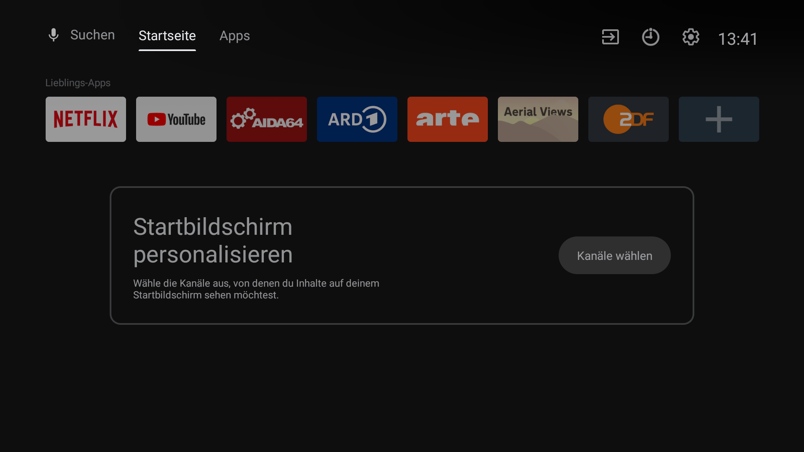
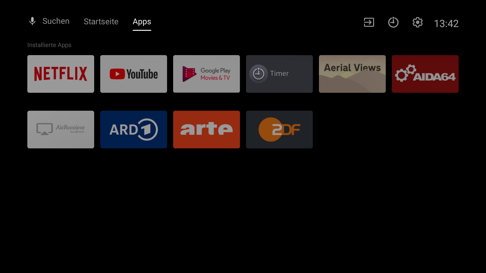

# 🛠️ Sony Bravia TV Debloating & Performance Optimization

This guide will help you effectively remove unnecessary apps and services ("bloatware") from your Sony Bravia Android TV, significantly improving system performance. After completing the debloating process, your TV will remain fully functional with installed apps, though some built-in features like standard TV channels and accessibility services might be impacted. Carefully review each step to avoid disabling functions you require.

---

## ✅ Goals

- Remove unnecessary background processes
- Free up RAM for better performance
- Achieve a clean, distraction-free user experience

---

## 🏆 Benefits

- Faster application load times
- Enhanced UI responsiveness
- Reduced CPU and network usage
- Ad-free and clutter-free launcher




---

## 📋 Table of Contents

1. [Requirements](#requirements)
2. [Preparation](#preparation)
3. [Setting Up ADB](#setting-up-adb)
4. [Identifying & Removing Bloatware](#identifying--removing-bloatware)
5. [Customizing the Launcher](#customizing-the-launcher)
6. [Optimizing System Performance](#optimizing-system-performance)
7. [Troubleshooting & Reverting Changes](#troubleshooting--reverting-changes)

---

## 🔎 Requirements

- Sony Bravia Android TV (tested on Android 9 Pie)
- Active network connection (Wi-Fi or LAN)
- Computer with ADB installed
- Basic familiarity with command-line operations

---

## 🚀 Preparation

### Enable Developer Options

- Navigate to: `Settings → Device Preferences → About`
- Tap `Build Number` **7 times** until it shows **Developer Mode Enabled**

### Enable ADB Debugging

- Navigate to: `Settings → Device Preferences → Developer Options`
- Turn on **Network Debugging**

---

## 🌐 Setting Up ADB

### Install ADB on your computer

- **Windows:** Download [Android Platform Tools](https://developer.android.com/studio/releases/platform-tools)
- **macOS:**
  ```bash
  brew install android-platform-tools
  ```
- **Linux:**
  ```bash
  sudo apt-get install android-tools-adb
  ```

### Connect to your TV via ADB

```bash
adb connect <TV_IP_ADDRESS>
```

### List installed apps

```bash
adb shell pm list packages
```

---

## 🔥 Identifying & Removing Bloatware

Below are recommended apps to remove. Use the following command structure to uninstall apps safely:

```bash
adb shell pm uninstall --user 0 <package_name>
```

| App Name                                 | Package Name                                 | Purpose                                      |
|------------------------------------------|----------------------------------------------|----------------------------------------------|
| Sony Video Frame Server                 | `com.sony.dtv.videoframeserver`              | Frame rendering service                      |
| Android Dreams Basic                    | `com.android.dreams.basic`                   | Screen saver service                         |
| Google Backdrop                         | `com.google.android.backdrop`                | Chromecast backdrop service                  |
| Screen Mirroring                        | `screenmirroring.com`                        | Mirroring service                            |
| Sony BraviaSync Setting                 | `com.sony.dtv.braviasyncsetting`             | Bravia Sync configuration                   |
| Sony BraviaSync Service                 | `com.sony.dtv.braviasyncservice`             | Bravia Sync service                          |
| Captive Portal Login                    | `com.android.captiveportallogin`             | Network captive portal                      |
| Sony Customer Support                   | `com.sony.dtv.customersupport`               | Customer support service                     |
| Sony Demo Mode                          | `com.sony.dtv.demomode`                      | TV demo mode                                 |
| Sony Multi-Screen Demo                  | `com.sony.dtv.multiscreendemo`               | Multi-screen demo                           |
| Sony Demo Support                       | `com.sony.dtv.demosupport`                   | Support for demo mode                       |
| Print Spooler                           | `com.android.printspooler`                   | Print management service                    |
| Sony Reminder Service                   | `com.sony.dtv.reminderservice`               | TV reminder service                         |
| Sony DA Service                         | `com.sony.dtv.da.service`                    | Direct access service                       |
| Google Backup Transport                 | `com.google.android.backuptransport`          | Backup data to Google                       |
| Google Play Games                       | `com.google.android.play.games`               | Google Play Games service                   |
| Sony HbbTV Launcher                    | `com.sony.dtv.hbbtvlauncher`                 | HbbTV interface                             |
| Sony iManual                            | `com.sony.dtv.imanual`                       | TV user manual                              |
| Sony Smart Help                         | `com.sony.dtv.smarthelp`                     | Smart help service                          |
| Sony Home Network                       | `com.sony.dtv.homenetwork`                   | Home network service                        |
| Sony Interactive TV Utility             | `com.sony.dtv.interactivetvutil`             | Interactive TV service                      |
| Android Location Fused                 | `com.android.location.fused`                 | Location services                           |
| Sony TVX Launcher Title List            | `com.sony.dtv.tvxlauncher.titlelist`          | Title list for TVX                         |
| Sony Smart Media App                    | `com.sony.dtv.smartmediaapp`                 | Smart media service                         |
| Sony OSAT Music                         | `com.sony.dtv.osat.music`                    | Music service                               |
| Sony Hotel Mode                         | `com.sony.dtv.b2b.hotelmode`                 | Hotel mode configuration                    |
| Sony TVX Launcher Program Guide         | `com.sony.dtv.tvxlauncher.programguide`       | TVX program guide                           |
| Sony Pro Settings                       | `com.sony.dtv.b2b.prosettings`               | Pro settings for TV                         |
| Sony Select                             | `com.sony.dtv.sonyselect`                    | Sony content store                          |
| Sony Accessibility Text                 | `com.sony.dtv.common.base.AccessibilityText`  | Accessibility settings                      |
| Sony TVX                                | `com.sony.dtv.tvx`                           | TVX core service                            |
| Sony Discovery                          | `com.sony.dtv.discovery`                     | Content recommendation                      |
| Sony YouView                            | `com.sony.dtv.youview`                       | TV content aggregation                      |
| Sony Promos                             | `com.sony.dtv.promos`                        | Promotional content                         |
| YouView Service Host                    | `com.youview.tv.servicehost`                  | Host for YouView service                    |
| Sony Browser WebApp Runtime             | `com.sony.dtv.browser.webappruntime`         | Web app execution service                   |
| VPN Dialogs                             | `com.android.vpndialogs`                     | VPN configuration                           |
| Sony Log Level Settings Vendor          | `com.sony.dtv.sonyloglevelsettingvnd`         | Vendor logging settings                     |
| Sony Log Level Settings System          | `com.sony.dtv.sonyloglevelsettingsys`         | System logging settings                     |
| Sony Bug Report System                  | `com.sony.dtv.sonybugreportsys`               | Bug report service                          |
| Google Tungsten Setup Wraith            | `com.google.android.tungsten.setupwraith`     | TV setup wizard                             |
| Settings Intelligence                  | `com.android.settings.intelligence`            | Google smart settings                       |
| Sony Service Mode                       | `com.sony.dtv.servicemode`                    | Developer service mode                      |
| Google SSS Authbridge                   | `com.google.android.sss.authbridge`            | Google authentication bridge                |
| Samba TV                                | `tv.samba.ssm`                                | TV content recommendation service            |
| User Dictionary Provider                | `com.android.providers.userdictionary`         | Personal dictionary provider                 |
| Google Feedback                         | `com.google.android.feedback`                  | Google feedback service                     |
| Contacts Provider                       | `com.android.providers.contacts`               | Manage and store contacts                   |
| Calendar Provider                       | `com.android.providers.calendar`               | Calendar data provider                      |
| Vewd Browser                            | `com.vewd.core.integration.dia`                | Web browsing platform                       |
| Google Contacts Sync                    | `com.google.android.syncadapters.contacts`     | Sync contacts with Google                   |
| Google Text-to-Speech                   | `com.google.android.tts`                      | Text-to-speech engine                       |
| Google Play Movies                      | `com.google.android.videos`                   | Google movie service                        |
| Google Partner Setup                    | `com.google.android.partnersetup`              | Google partner configuration                |
| Google Calendar Sync                    | `com.google.android.syncadapters.calendar`     | Sync calendar with Google                   |
| Google Search (Katniss)                 | `com.google.android.katniss`                  | Google search integration                   |
| Google TV Bug Report Sender             | `com.google.android.tv.bugreportsender`        | Send TV bug reports to Google               |
| Google TV Recommendations               | `com.google.android.tvrecommendations`         | Google TV content suggestions               |
| Google Webview                          | `com.google.android.webview`                   | Web rendering engine                        |
| Google Talkback                         | `com.google.android.marvin.talkback`            | Accessibility service                       |
| Sony Select Overlay                     | `com.sony.dtv.sonyselect.overlay`              | Sony content overlay                        |


## 🚫 Script for all apps above

```bash
adb shell pm uninstall --user 0 com.sony.dtv.videoframeserver
adb shell pm uninstall --user 0 com.android.dreams.basic
adb shell pm uninstall --user 0 com.google.android.backdrop
adb shell pm uninstall --user 0 screenmirroring.com
adb shell pm uninstall --user 0 com.sony.dtv.braviasyncsetting
adb shell pm uninstall --user 0 com.sony.dtv.braviasyncservice
adb shell pm uninstall --user 0 com.android.captiveportallogin
adb shell pm uninstall --user 0 com.sony.dtv.customersupport
adb shell pm uninstall --user 0 com.sony.dtv.demomode
adb shell pm uninstall --user 0 com.sony.dtv.multiscreendemo
adb shell pm uninstall --user 0 com.sony.dtv.demosupport
adb shell pm uninstall --user 0 com.android.printspooler
adb shell pm uninstall --user 0 com.sony.dtv.reminderservice
adb shell pm uninstall --user 0 com.sony.dtv.da.service
adb shell pm uninstall --user 0 com.google.android.backuptransport
adb shell pm uninstall --user 0 com.google.android.play.games
adb shell pm uninstall --user 0 com.sony.dtv.hbbtvlauncher
adb shell pm uninstall --user 0 com.sony.dtv.imanual
adb shell pm uninstall --user 0 com.sony.dtv.smarthelp
adb shell pm uninstall --user 0 com.sony.dtv.homenetwork
adb shell pm uninstall --user 0 com.sony.dtv.interactivetvutil
adb shell pm uninstall --user 0 com.android.location.fused
adb shell pm uninstall --user 0 com.sony.dtv.tvxlauncher.titlelist
adb shell pm uninstall --user 0 com.sony.dtv.smartmediaapp
adb shell pm uninstall --user 0 com.sony.dtv.osat.music
adb shell pm uninstall --user 0 com.sony.dtv.b2b.hotelmode
adb shell pm uninstall --user 0 com.sony.dtv.tvxlauncher.programguide
adb shell pm uninstall --user 0 com.sony.dtv.b2b.prosettings
adb shell pm uninstall --user 0 com.sony.dtv.sonyselect
adb shell pm uninstall --user 0 com.sony.dtv.common.base.AccessibilityText
adb shell pm uninstall --user 0 com.sony.dtv.tvx
adb shell pm uninstall --user 0 com.sony.dtv.discovery
adb shell pm uninstall --user 0 com.sony.dtv.youview
adb shell pm uninstall --user 0 com.sony.dtv.promos
adb shell pm uninstall --user 0 com.youview.tv.servicehost
adb shell pm uninstall --user 0 com.sony.dtv.browser.webappruntime
adb shell pm uninstall --user 0 com.android.vpndialogs
adb shell pm uninstall --user 0 com.sony.dtv.sonyloglevelsettingvnd
adb shell pm uninstall --user 0 com.sony.dtv.sonyloglevelsettingsys
adb shell pm uninstall --user 0 com.sony.dtv.sonybugreportsys
adb shell pm uninstall --user 0 com.google.android.tungsten.setupwraith
adb shell pm uninstall --user 0 com.android.settings.intelligence
adb shell pm uninstall --user 0 com.sony.dtv.servicemode
adb shell pm uninstall --user 0 com.google.android.sss.authbridge
adb shell pm uninstall --user 0 tv.samba.ssm
adb shell pm uninstall --user 0 com.android.providers.userdictionary
adb shell pm uninstall --user 0 com.google.android.feedback
adb shell pm uninstall --user 0 com.android.providers.contacts
adb shell pm uninstall --user 0 com.android.providers.calendar
adb shell pm uninstall --user 0 com.vewd.core.integration.dia
adb shell pm uninstall --user 0 com.google.android.syncadapters.contacts
adb shell pm uninstall --user 0 com.google.android.tts
adb shell pm uninstall --user 0 com.google.android.videos
adb shell pm uninstall --user 0 com.google.android.partnersetup
adb shell pm uninstall --user 0 com.google.android.syncadapters.calendar
adb shell pm uninstall --user 0 com.google.android.katniss
adb shell pm uninstall --user 0 com.google.android.tv.bugreportsender
adb shell pm uninstall --user 0 com.google.android.tvrecommendations
adb shell pm uninstall --user 0 com.google.android.webview
adb shell pm uninstall --user 0 com.google.android.marvin.talkback
adb shell pm uninstall --user 0 com.sony.dtv.sonyselect.overlay
```

## ➡️ Disable apps 
 
We just want to  disable these apps so if we need them again we cant just re-enable them without the need of a computer. 
 
```bash
 
adb shell pm disable-user --user 0 com.google.android.apps.mediashell
 
adb shell pm disable-user --user 0 com.android.vending
 
adb shell pm disable-user --user 0 com.google.android.gms
 
```

## 🎨 Customizing the Launcher

Disable unwanted tabs and content in your launcher:

```bash
adb shell settings put secure tv_home_shop_content_enabled 0
adb shell settings put secure tv_home_personalized_ads_enabled 0
adb shell settings put secure tv_home_content_suggestions_enabled 0
adb shell settings put secure tv_home_promotion_tile_enabled 0
```

Clear the launcher data for changes to apply:

```bash
adb shell pm clear com.google.android.tvlauncher
```

---

## 🚀 Optimizing System Performance

Apply these settings to enhance responsiveness:

```bash
adb shell setprop persist.sys.input_lag 0
adb shell settings put global game_mode 1
adb shell settings put global window_animation_scale 0.5
adb shell settings put global transition_animation_scale 0.5
adb shell settings put global animator_duration_scale 0.5
```

---

## ⚙️ Troubleshooting & Reverting Changes

### Reinstall apps

```bash
adb shell cmd package install-existing <package_name>
```

### Reactivate disabled apps

```bash
adb shell pm enable <package_name>
```

### Issues after enabling Play Services

Re-enabling Google Play Services may cause extra tabs to reappear. To revert:

```bash
adb shell pm clear com.google.android.tvlauncher
```


